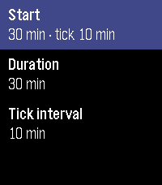
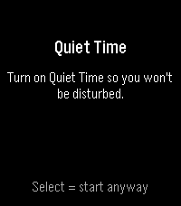
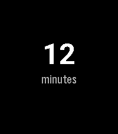

# Vipassana

A silent, tactile meditation timer for Pebble. It marks a sitting with
vibrations alone — no bells, no sound, no screen to look at. You feel the rhythm
of the session on your wrist and keep your eyes closed.

Built for **Pebble Time 2** (`emery`, 200×228 colour) and **basalt**, with the
classic Pebble C SDK (SDK 3).

## Screenshots

| Setup | Quiet Time | Sitting | Summary |
|:-----:|:----------:|:-------:|:-------:|
|  |  |  |  |

<sub>Pebble Time 2 (`emery`). Regenerate any time with `tools/generate-screenshots.sh` — see [Build & run](#build--run).</sub>

## Why

People who practice Vipassana want a timer that is **on the wrist, silent, and
felt** — one that paces a sitting only through vibration. Phone apps distract,
buzz crudely, and tempt you to look at the screen. The watch is discreet, always
there, and speaks through touch alone.

Sessions are **open-ended**: the duration you pick is not an end but a *cycle*
that repeats for as long as you sit, without breaking the rhythm.

## How it works

### Setup (before sitting)

- On open, the app shows your **last-used configuration** already selected. A
  single tap on **Select** starts the session right away — the common case
  ("same as yesterday") is one gesture.
- To change: **cycle duration** (10 / 15 / 20 / 30 / 45 / 60 min) and **tick
  interval** (10 min / 30 min / off) adjust with up/down, then Select.
- The configuration is **persisted** and survives closing the app and rebooting
  the watch.

### During the sitting

- The screen shows **only the elapsed time**, large and centred, in minutes
  (`34 min`).
- No progress bar, no countdown, no cycle counter. The screen is deliberately
  not something to attend to. Backlight off, dark background — readable only if
  you turn your wrist.
- Time **keeps climbing across loops** (a 30-min cycle reads `34`, `35`… `65 min`).

### Vibration markers

| Event           | Pattern                        | When                          |
|-----------------|--------------------------------|-------------------------------|
| Periodic tick   | brief tap (single)             | every 10 or 30 min            |
| Mid-cycle       | medium double                  | halfway through the cycle     |
| End of cycle    | two long "gong" pulses, then restart | the sitting does **not** stop |

The three patterns are deliberately distinct in rhythm (intensity is fixed by
hardware), so mid-cycle and end-of-cycle are never confused with eyes closed.
At the end of a cycle the markers reset and the cycle begins again, while the
total timer keeps running.

### Quiet Time

Pebble's Quiet Time is read-only — no app can turn it on or off. So:

- When you start a session the app checks `quiet_time_is_active()`.
- If it's **off**, a reminder screen suggests turning it on before you begin
  (you can still proceed).
- If it's **on**, the session starts directly.

The session's own ticks and markers vibrate regardless of Quiet Time — they are
the whole point of the app. Quiet Time only silences *external* notifications.

### Stopping

The Back button stops the session **with confirmation**, so you don't leave a
sitting by accident, then shows a summary of the total time.

## Localization

All user-facing strings follow the **system language**. The language is detected
once at startup via `i18n_get_system_locale()`, matched on the locale's
two-letter prefix. Supported: **English** (default), **Italian**, **Spanish**,
**French**, **German**, **Portuguese**; anything else falls back to English.
Strings live in one table per language in `src/c/locale.c` — adding a language is
one more block plus a line in the prefix map. Universal tokens (`min`, `tick`,
`off`, the `Select` button name, the `Quiet Time` feature name) are intentionally
left untranslated.

## Architecture

The behavioural core is a single **pure function** of `(elapsed seconds,
config)` — every tick, half, end, the infinite loop, and collision precedence
(end > half > tick) are derived from absolute elapsed time, so there is **zero
drift** across long sittings.

| File                    | Responsibility                                        |
|-------------------------|-------------------------------------------------------|
| `src/c/main.c`          | config (load/save) and the navigation router          |
| `src/c/setup_window.c`  | pre-session config (duration / interval / start)      |
| `src/c/quiet_window.c`  | the "turn on Quiet Time" reminder                     |
| `src/c/session_window.c`| the running session, confirm-stop, summary            |
| `src/c/markers.c`       | the pure cycle/tick/half/end scheduler                |
| `src/c/locale.c`        | system-language string tables (EN/IT/ES/FR/DE/PT)     |

The scheduler is battery-friendly: it computes the next marker, sleeps an
`app_timer` until exactly that instant, fires, and recomputes from absolute
time — timing never accumulates error.

## Build & run

Requires the Pebble SDK (`pebble` CLI + QEMU emulator).

```sh
pebble build                          # compile (waf / wscript)
pebble install --emulator emery       # run in the emulator
pebble install --phone <ip>           # install on a watch
```

There is no unit-test framework for Pebble: verify by running in the emulator
and taking screenshots. (The marker logic, being a pure function, can also be
checked by compiling `markers.c` on the host.)

### Regenerating the store screenshots

```sh
tools/generate-screenshots.sh           # default: emery
tools/generate-screenshots.sh basalt    # any target platform
```

The script captures the four representative screens into
`screenshots/<platform>/` with **zero manual clicks**, using two tricks to stay
reproducible:

- **config `30 min · tick 10 min`** — it wipes the emulator's persisted state so
  the config falls back to the built-in defaults (`DEFAULT_DURATION` /
  `DEFAULT_INTERVAL`), instead of cycling buttons.
- **a non-zero `12 minutes` readout** — it builds with
  `SCREENSHOT_FAKE_ELAPSED=720`, which `wscript` turns into a `-D` define that
  back-dates the session start by 12 min. The macro is `#ifdef`-guarded in
  `session_window.c`, so a normal `pebble build` is unaffected; the script
  restores a clean build when it finishes.

It also hard-resets the flaky pypkjs↔QEMU relay and retries on `TimeoutError`,
so it's safe to re-run.

## Scope

In: silent tactile timer, looping cycles, periodic/half/end markers, persisted
preset, Quiet-Time detection, stop-with-summary.

Out (deliberately): audio/bells, statistics/streaks/history, accounts/cloud, a
complex phone companion, visible countdown or cycle count, guided content.

## Project docs

- `PITCH.md` — Shape Up pitch (problem, solution, rabbit holes, no-gos).
- `SCOPING.md` — scoping notes.
