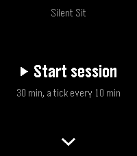
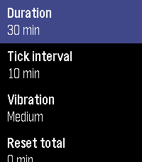
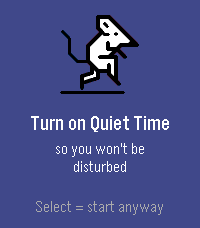
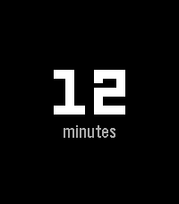
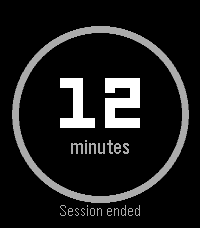

# Silent Sit

A silent, tactile meditation timer for Pebble. It marks a sitting with
vibrations alone — no bells, no sound, no screen to look at. You feel the rhythm
of the session on your wrist and keep your eyes closed.

Built for **Pebble Time 2** (`emery`, 200×228 colour) with the classic Pebble C
SDK (SDK 3).

## Screenshots

| Home | Settings | Quiet Time | Sitting | Summary |
|:----:|:--------:|:----------:|:-------:|:-------:|
|  |  |  |  |  |

<sub>Pebble Time 2 (`emery`). Regenerate any time with `tools/generate-screenshots.sh` — see [Build & run](#build--run).</sub>

## Why

People who practice Vipassana want a timer that is **on the wrist, silent, and
felt** — one that paces a sitting only through vibration. Phone apps distract,
buzz crudely, and tempt you to look at the screen. The watch is discreet, always
there, and speaks through touch alone.

Sessions are **open-ended**: the duration you pick is not an end but a *cycle*
that repeats for as long as you sit, without breaking the rhythm.

## How it works

### Home & settings (before sitting)

- The **home screen** leads with the primary action — **▶ Start session** — and
  shows your current configuration beneath it (e.g. `30 min, a tick every
  10 min`). A single press of **Select** starts the sitting right away: the
  common case ("same as yesterday") is one gesture. The small title at the top
  quietly alternates between the app name and your lifetime total of time
  meditated with the app.
- Press **Down** to open **settings**, a short menu to cycle the **duration**
  (10 / 15 / 20 / 30 / 45 / 60 min), **tick interval** (10 min / 30 min / off),
  and **vibration strength** (Light / Medium / Strong). **Select** cycles a
  value; **Back** returns to the home screen with its summary updated. A final
  row resets the lifetime total — a two-press confirm guards against a stray tap.
- The configuration and the lifetime total are **persisted** and survive closing
  the app and rebooting the watch.

### During the sitting

- The screen shows **only the elapsed time**, large and centred, in minutes
  (`34 min`).
- No progress bar, no countdown, no cycle counter. The screen is deliberately
  not something to attend to. Backlight off, dark background — readable only if
  you turn your wrist.
- Time **keeps climbing across loops** (a 30-min cycle reads `34`, `35`… `65 min`).

### Vibration markers

| Event           | Pattern                        | When                          |
|-----------------|--------------------------------|-------------------------------|
| Periodic tick   | brief tap (single)             | every 10 or 30 min            |
| Mid-cycle       | medium double                  | halfway through the cycle     |
| End of cycle    | two long "gong" pulses, then restart | the sitting does **not** stop |

The three patterns are deliberately distinct in rhythm (intensity is fixed by
hardware), so mid-cycle and end-of-cycle are never confused with eyes closed.
The **vibration strength** setting (Light / Medium / Strong, default Medium)
lengthens the buzzes — stretching the pulses while leaving the gaps untouched —
so each marker keeps its rhythm and only feels more emphatic. At the end of a
cycle the markers reset and the cycle begins again, while the total timer keeps
running.

### Quiet Time

Pebble's Quiet Time is read-only — no app can turn it on or off. So:

- When you start a session the app checks `quiet_time_is_active()`.
- If it's **off**, a reminder screen suggests turning it on before you begin
  (you can still proceed).
- If it's **on**, the session starts directly.

The session's own ticks and markers vibrate regardless of Quiet Time — they are
the whole point of the app. Quiet Time only silences *external* notifications.

### Stopping

The Back button stops the session **with confirmation**, so you don't leave a
sitting by accident, then shows a summary of the total time, its status line
alternating with your lifetime total.

## Localization

All user-facing strings follow the **system language**. The language is detected
once at startup via `i18n_get_system_locale()`, matched on the locale's
two-letter prefix. Supported: **English** (default), **Italian**, **Spanish**,
**French**, **German**, **Portuguese**; anything else falls back to English.
Strings live in one table per language in `src/c/locale.c` — adding a language is
one more block plus a line in the prefix map. Universal tokens (`min`, `tick`,
`off`, the `Select` button name, the `Quiet Time` feature name) are intentionally
left untranslated.

## Architecture

The behavioural core is a single **pure function** of `(elapsed seconds,
config)` — every tick, half, end, the infinite loop, and collision precedence
(end > half > tick) are derived from absolute elapsed time, so there is **zero
drift** across long sittings.

| File                    | Responsibility                                        |
|-------------------------|-------------------------------------------------------|
| `src/c/main.c`          | config + lifetime total (load/save) and the navigation router |
| `src/c/setup_window.c`  | home screen (Start action + config summary + Down)    |
| `src/c/settings_window.c`| the settings menu — duration, tick, vibration, reset (reached with Down) |
| `src/c/quiet_window.c`  | the "turn on Quiet Time" reminder                     |
| `src/c/session_window.c`| the running session, confirm-stop, summary            |
| `src/c/markers.c`       | the pure cycle/tick/half/end scheduler                |
| `src/c/locale.c`        | system-language string tables (EN/IT/ES/FR/DE/PT)     |

The scheduler is battery-friendly: it computes the next marker, sleeps an
`app_timer` until exactly that instant, fires, and recomputes from absolute
time — timing never accumulates error.

## Build & run

Requires the Pebble SDK (`pebble` CLI + QEMU emulator).

```sh
pebble build                          # compile (waf / wscript)
pebble install --emulator emery       # run in the emulator
pebble install --phone <ip>           # install on a watch
pebble install --cloudpebble          # install via the CloudPebble connection
```

There is no unit-test framework for Pebble: verify by running in the emulator
and taking screenshots. (The marker logic, being a pure function, can also be
checked by compiling `markers.c` on the host.)

## Publishing to the appstore

The app is published to the [rePebble appstore](https://apps.rePebble.com/9170d8ea82e842e6b0abdbe3)
(`appstore-api.repebble.com`) with the `pebble publish` command. One-time auth:

```sh
pebble login                            # Firebase auth (opens a browser)
pebble login --status                   # confirm you're logged in + dev link
```

Then publish. The store description lives in `STORE.txt`, the listing
screenshots in `screenshots/emery/`:

```sh
pebble publish \
  --non-interactive \
  --name "Silent Sit" \
  --version 1.0.0 \
  --category health \
  --description "$(cat STORE.txt)" \
  --release-notes "First release" \
  --icon-small resources/marketplace_small.png \
  --icon-large resources/marketplace_large.png \
  --screenshots screenshots/emery/emery_*.png \
  --no-gif-all-platforms
```

`pebble publish` builds the `.pbw`, creates (or updates) the appstore listing,
and uploads the release. The web dashboard at `appstore-api.repebble.com/dashboard`
is the equivalent for editing the listing afterwards.

The listing (marketplace) icons are **separate** from the on-watch menu icon
(`resources/icon.png`, a 25×25 monochrome silhouette that Pebble tints): they are
full-colour tiles on an indigo background. The publish-ready PNGs are committed —
`resources/marketplace_small.png` (48×48, the flat droplet — stays crisp in app
lists) and `resources/marketplace_large.png` (144×144, the detailed droplet with
ripples). They have no committed masters; regenerate them from the image-generator
prompts and downscale recipe in [`resources/marketplace-icons.md`](resources/marketplace-icons.md).

If `--icon-large` is omitted, `pebble publish` instead auto-generates a large icon
from `--icon-small`.

### Tag each release

After a successful publish, tag the released commit so the appstore version maps
to a point in history, then push the tag:

```sh
git tag -a v1.1.0 -m "Silent Sit 1.1.0"   # match the published --version
git push origin main --follow-tags         # push commits and the new tag(s)
```

Tags are named `vX.Y.Z`, matching `version` in `package.json` and the
`--version` passed to `pebble publish`.

Three things that will otherwise bite you:

- **Screenshot filenames must start with `<platform>_`** (underscore). The tool
  infers the platform by splitting the *basename* on the first `_` — the
  containing folder is ignored. `screenshots/emery/emery_01-home.png` works;
  `…/01-home.png` fails with *"Could not infer platform"*. `generate-screenshots.sh`
  already names them this way. Screenshots are mandatory.
- **`--category` must be one of** `daily`, `tools`, `notifications`, `remotes`,
  `health`, `games` (aliases: `fitness`→`health`, `game`→`games`, …). Anything
  else (e.g. `"Health & Fitness"`) is sent verbatim and the backend answers
  *500 Failed to create app record*. Silent Sit uses `health`.
- **Each release version must be unique and increasing.** Re-running with an
  already-published `--version` fails *400 Version X already exists*; bump
  `version` in `package.json` (and the command above) for every new release.
  The release is made publicly visible on upload — there is no separate
  "publish" toggle in the CLI.

### Regenerating the store screenshots

```sh
tools/generate-screenshots.sh           # emery (the only target platform)
```

The script captures the five representative screens into
`screenshots/<platform>/` with **zero manual clicks**, using two tricks to stay
reproducible:

- **default config (`30 min, a tick every 10 min`)** — it wipes the emulator's
  persisted state so the config falls back to the built-in defaults
  (`DEFAULT_DURATION` / `DEFAULT_INTERVAL`), instead of cycling buttons.
- **a non-zero `12 minutes` readout** — it builds with
  `SCREENSHOT_FAKE_ELAPSED=720`, which `wscript` turns into a `-D` define that
  back-dates the session start by 12 min. The macro is `#ifdef`-guarded in
  `session_window.c`, so a normal `pebble build` is unaffected; the script
  restores a clean build when it finishes.

It also hard-resets the flaky pypkjs↔QEMU relay and retries on `TimeoutError`,
so it's safe to re-run.

### Regenerating the icon resources

The in-window glyphs — the home-screen play `▶` and Down caret, and the Quiet
Time mouse — are **Pebble Draw Command (PDC) vectors**, not bitmaps, so they
stay crisp at any size. Their SVG masters live in `resources/` (`action_start.svg`,
`caret_down.svg`, `quiet_time_mouse.svg`); the compiled `*.pdc` files are checked
in. Edit a master, then:

```sh
tools/generate-pdc.sh                    # re-converts all three SVGs -> *.pdc
```

Conversion uses [`pdc_tool`](https://github.com/HBehrens/pdc_tool) (a single
binary). The script finds it on `PATH` / in `tools/`, or **downloads the matching
release into `tools/` on demand** (gitignored) if it's missing — so a fresh
checkout needs nothing pre-installed. The glyphs are authored white for the dark
UI; the mouse keeps its black outline (legible on the indigo Quiet Time
background) and converts at its native 80px — PDC has no draw-time scaling, so
downscaling it would smear the thin strokes. The menu icon (`resources/icon.png`)
stays a bitmap — Pebble menu icons can't be PDC.

## Scope

In: silent tactile timer, looping cycles, periodic/half/end markers, adjustable
vibration strength, persisted preset, a single lifetime total, Quiet-Time
detection, stop-with-summary.

Out (deliberately): audio/bells, streaks/history/charts, accounts/cloud, a
complex phone companion, visible countdown or cycle count, guided content.
